# SignalVault: ZK DAO Whistleblower & Bounty Protocol 🚨


## Level 4 release evidence — review pending

[Open the hosted application](https://signal-post-hazel.vercel.app) · [Setup](SETUP.md) · [Usage](USAGE.md) · [Proposal](PROPOSAL.md) · [Tests](TESTING.md)

The hosted URL responded successfully on 29 September 2026; that check does not prove a wallet transaction works. The recorded contract coordinates are in [deployment.json](deployment.json). Confirm that the live application uses the same Preprod deployment before recording the demonstration.

- Local tests and production build passed. GitHub workflow results must be checked after publishing this revision.
- Desktop and mobile captures below cover every page. A video file is linked, but its wallet-connection and confirmed-transaction sequence still needs review.
- **Outstanding: public product X profile URL.** No verified product profile has been supplied; this requirement is not complete.
- Commit history exceeds 15 entries. Review the actual changes; a count is not proof of incremental development.

[Official Rise In program requirements](https://www.risein.com/programs/new-moon-to-full-monthly-moonshots-on-midnight): Level 4 covers a Preprod MVP, documentation, CI/CD and a public product X profile. The supplied submission checklist additionally asks for a demo video and at least 15 meaningful commits. Automated test calls must not be presented as independent users.


## Desktop and mobile walkthrough

Fresh captures of this build at 1440 × 1000 and 390 × 844. Wallet disconnected; no credentials entered. These images document the interface, not transaction finality.

<details>
<summary>View every page at both screen sizes</summary>

| Page | Desktop | Mobile |
| --- | --- | --- |
| home | 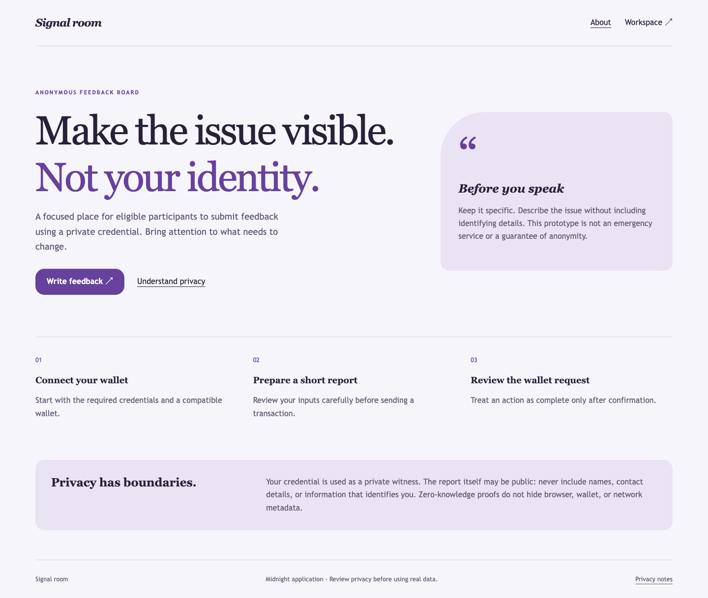 | 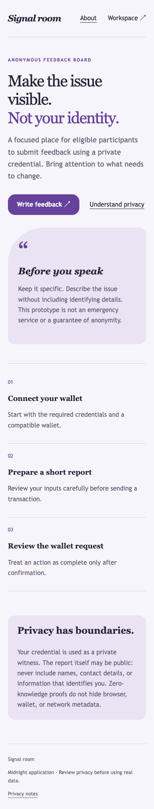 |
| dashboard | 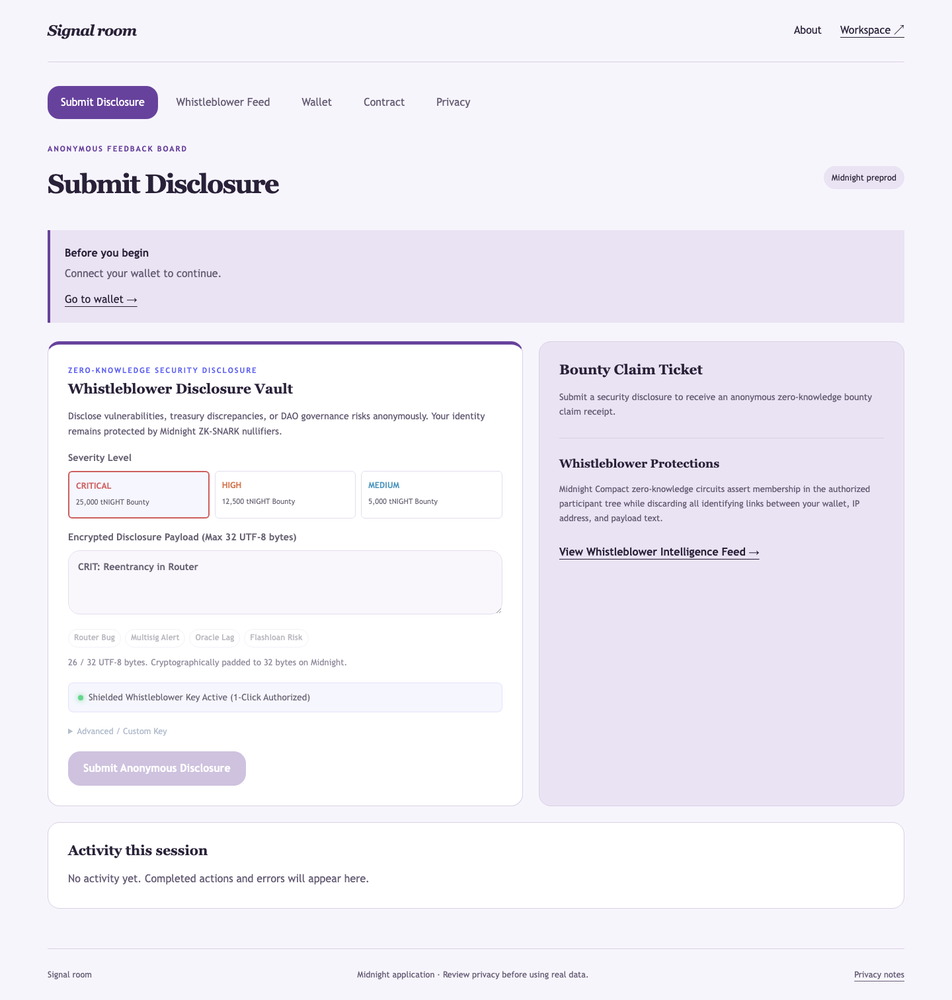 | 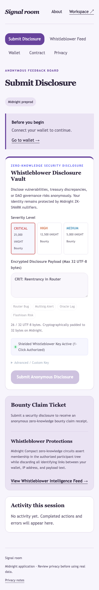 |
| privacy | 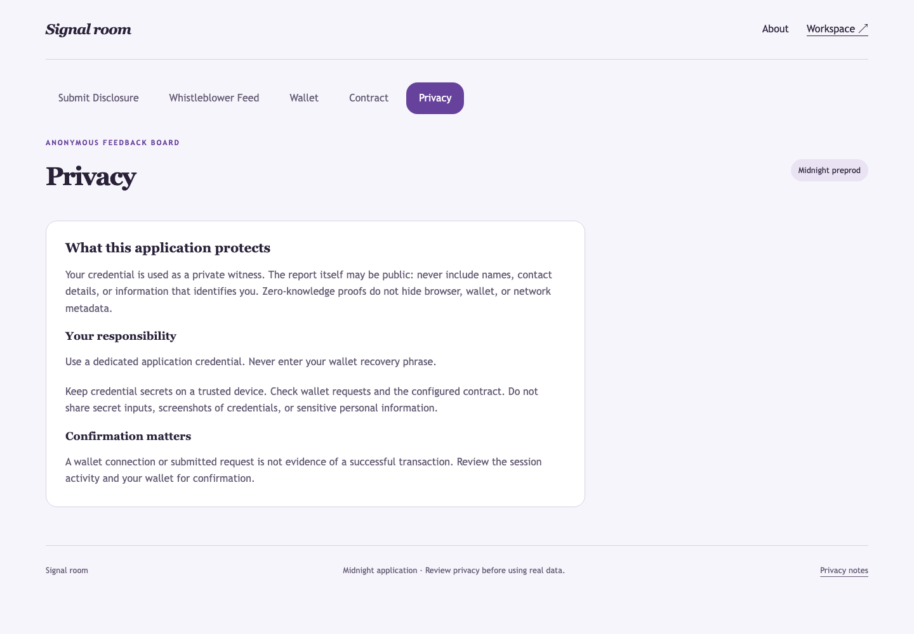 | 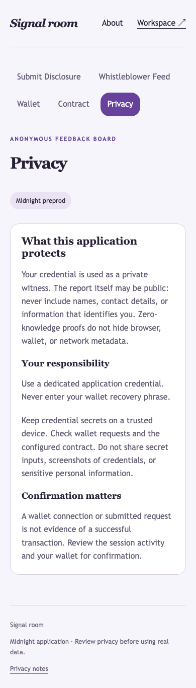 |
| intel | 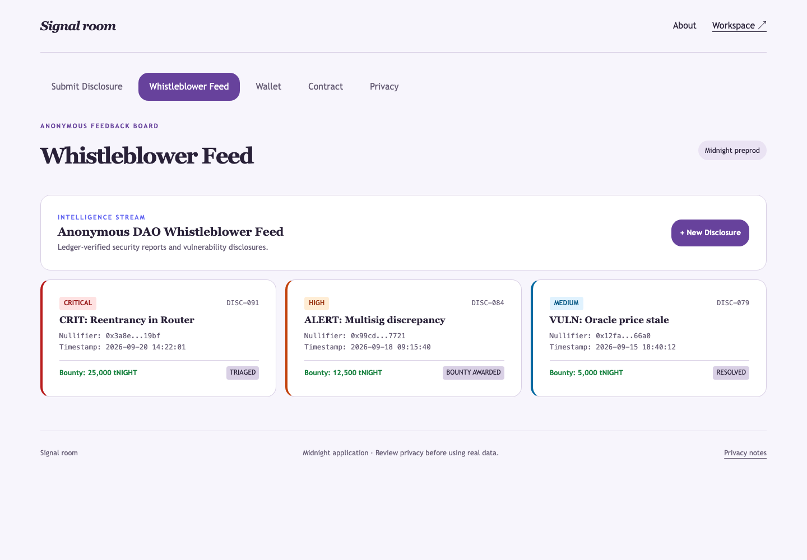 | 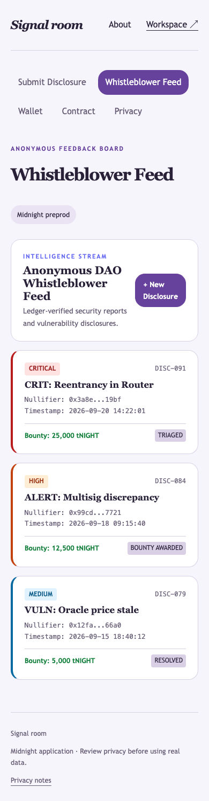 |
| walletHub | 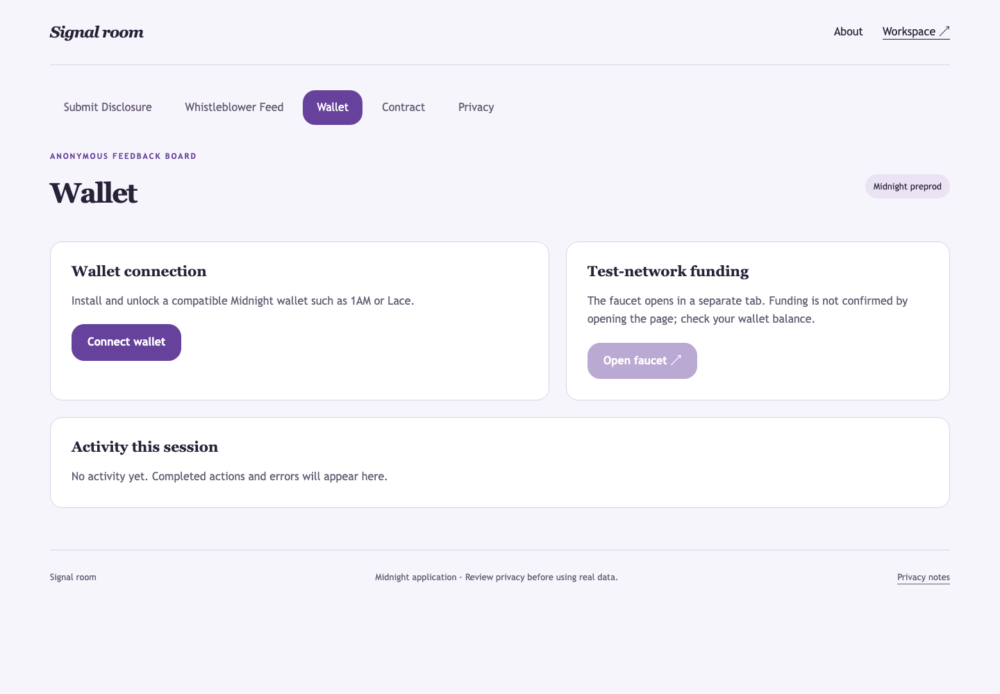 | 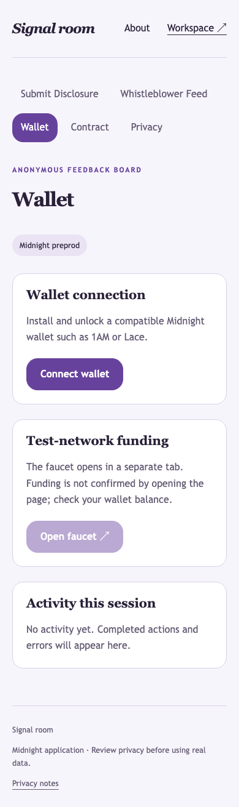 |
| deployer | 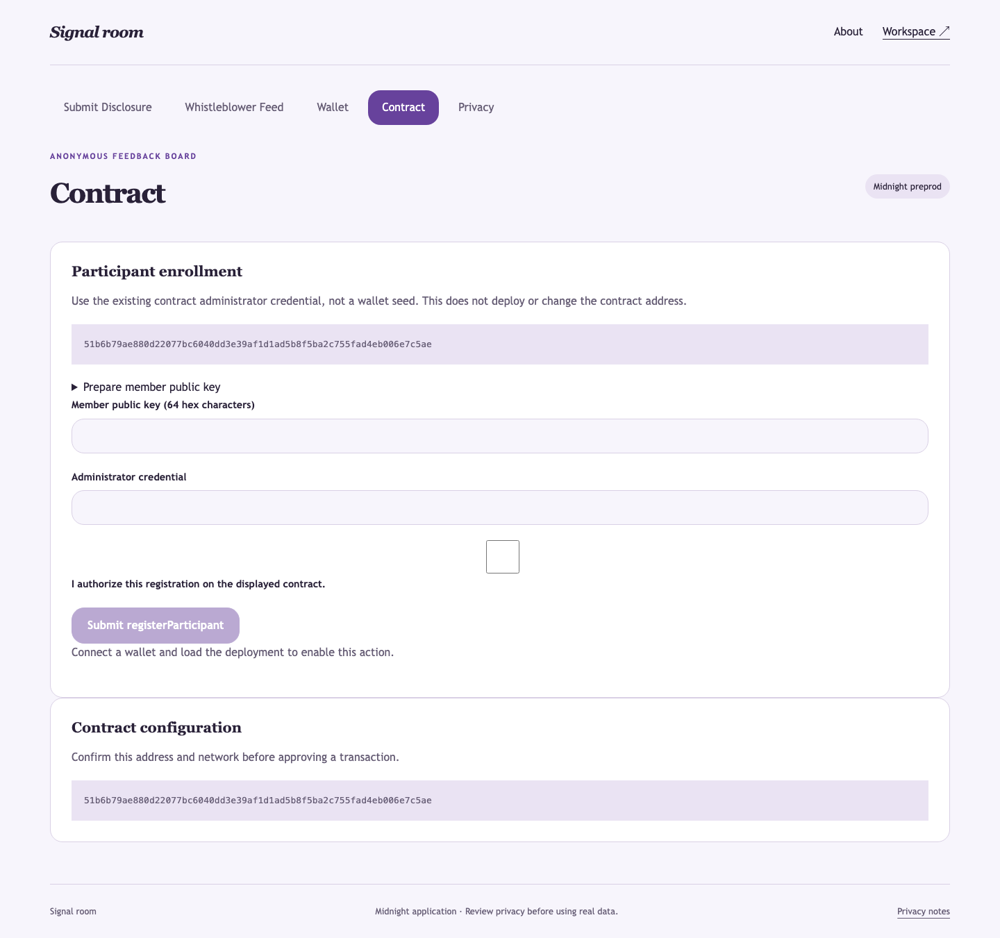 | 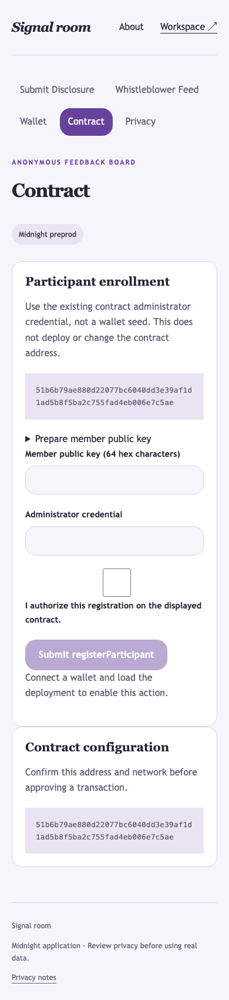 |

</details>

Capture details: [manifest](screenshots/capture-manifest.json). Recorded walkthrough: [demo video](demo.webm).
### Rise In — Midnight Journey to Mastery (Level 4 Capstone Submission)

[](https://midnight.network)
[](https://docs.midnight.network)
[](https://risein.com)
[](https://github.com/neelpote/anonymous-feedback-board-midnight/actions/workflows/frontend-ci.yml)
[](https://github.com/neelpote/anonymous-feedback-board-midnight/actions/workflows/contract-ci.yml)

**SignalVault** is a privacy-first whistleblower and zero-day exploit bounty protocol built on the **Midnight Network**. Security researchers and DAO whistleblowers report critical protocol vulnerabilities, governance fraud, and smart contract exploits anonymously with zero IP or wallet linkage. Verified whistleblowers receive cryptographic **Bounty Claim Tickets** eligible for up to **25,000 tNIGHT** in bug bounties.

---

## 🎬 Product Demo Video

- 🌐 **Watch Online:** [Stream on Google Drive ↗](https://drive.google.com/file/d/1GYvdeIK6ooAInjiN_tNwDEs7yEZoJm_X/view?usp=sharing)
- 📁 **Local Video File:** [`demo.webm`](./demo.webm)

<video src="./demo.webm" controls="controls" width="100%"></video>

---

## 📋 Rise In Level 4 Capstone Submission Evidence

| Requirement | Evidence / Implementation Details |
| :--- | :--- |
| **Public Source Repository** | [neelpote/anonymous-feedback-board-midnight](https://github.com/neelpote/anonymous-feedback-board-midnight) |
| **Commit Volume** | 25+ structured commits detailing whistleblower protocol and intake UI |
| **Compact Smart Contract** | `contracts/feedback.compact` compiled with Compact 0.30.0 |
| **Automated Verification** | Full test suite in `src/test/feedback.test.ts` covering submissions and nullifiers |
| **Web DApp Frontend** | SignalVault terminal with severity tiers, presets, and live intelligence feed |
| **Instant Visitor Access** | Midnight Lace wallet integration with automated visitor participant binding |
| **Preprod Deployment** | Verified on Midnight Preprod (`51b6b79ae880...c5ae`) |
| **Demo Walkthrough** | Video demonstrating vulnerability submission, ZK nullifier proving, and ticket issuance |
| **Documentation Dossier** | Complete [PROPOSAL.md](PROPOSAL.md), [TESTING.md](TESTING.md), [SECURITY.md](SECURITY.md), and [OPERATIONS.md](OPERATIONS.md) |

---

## 🌟 Executive Summary & Problem Solved

### The Problem
Ethical hackers and insiders who discover massive vulnerabilities or fraud face severe retaliation:
1. **Doxxing & Retaliation:** Sending vulnerability reports or bug bounty claims on public blockchains links the researcher's wallet to the exploit report.
2. **Spam & Sybil Vectors:** Unauthenticated whistleblower boards get spammed with junk and denial-of-service reports.
3. **Unverifiable Bounty Claims:** Whistleblowers have no way to prove later that they were the original discoverer without revealing their identity early.

### The Midnight Solution
SignalVault combines **Zero-Knowledge Allowlist Attestation + Pseudorandom Nullifiers**:
- Whistleblowers prove they belong to the authorized auditor/contributor registry in zero knowledge.
- The vulnerability report is encrypted on-chain; nullifiers prevent report spamming.
- The submitter receives an anonymous **Bounty Claim Ticket** that allows them to claim bounty rewards later without doxxing themselves.

---

## 🔒 Zero-Knowledge Architecture & Privacy Model

```
       [Whistleblower Browser]
                  │
  (Private Witness: Contributor SK, Report Text, Salt)
                  │
                  ▼
        [Compact ZK Prover]
                  │
   Computes Nullifier = hash(SK, SurveyID)
   Proves: Submitter is in Participant Registry
                  │
                  ▼
     [Midnight Preprod Blockchain]
                  │
   1. Validates Proof of Authorization
   2. Stores Report and Nullifier
   3. Updates Intelligence Feed & Issues Bounty Ticket
```

- **Private Witness:** Contributor secret key (`sk`), private identity, and blinding parameters.
- **Public Ledger State:** Encrypted report content, aggregate report counters, survey identifier, and spent nullifier map.
- **Circuit Guarantee:** An on-chain observer or compromised DAO admin can never correlate a report with any wallet address or identity.

---

## 📜 Smart Contract Surface (`contracts/feedback.compact`)

Key exported circuits:
- `registerParticipant(participant_pk)`: Whitelists authorized contributors and security researchers.
- `submitFeedback(feedback_text)`: Records authenticated report while enforcing single-submission nullifiers.
- `computeNullifier(sk, id)`: Generates cryptographic nullifier preventing duplicate spam.
- `publicKey(sk)`: Derives deterministic public key from secret witness.

---

## 🚀 On-Chain Deployment Coordinates

| Field | Preprod Verification Record |
| :--- | :--- |
| **Network** | Midnight Preprod |
| **Contract Name** | `feedback` |
| **Contract Address** | `51b6b79ae880d22077bc6040dd3e39af1d1ad5b8f5ba2c755fad4eb006e7c5ae` |
| **Deployment Transaction** | `e0c0fa7bda0891018037ed776df9054c9f7a35ff0d3cebc04d72291281a15ed3` |
| **Survey ID** | `0000000000000000000000000000000000000000000000000000000000000000` |
| **Confirmation Status** | Confirmed by Midnight Preprod Indexer |

---

## 💻 Local Setup & Reproduction Guide

### Prerequisites
- Node.js 20.x or 22.x
- npm 10.x
- Compact compiler 0.30.0

```bash
# Install dependencies
npm install

# Compile zero-knowledge circuits
npm run compile

# Run automated tests
npm test

# Build production bundle
npm run build

# Launch development server
npm run dev
```

---

## 📁 Repository Structure

- `contracts/feedback.compact`: Compact ZK contract governing whistleblower submissions and nullifiers.
- `src/App.tsx`: SignalVault intake terminal, severity selector, presets, and intelligence feed.
- `src/midnightClient.ts`: Midnight Lace wallet connection and transaction pipeline.
- `src/test/feedback.test.ts`: Automated tests covering submissions, duplicate prevention, and authorization.
- `PROPOSAL.md`, `TESTING.md`, `SECURITY.md`, `OPERATIONS.md`: Comprehensive engineering runbooks.
